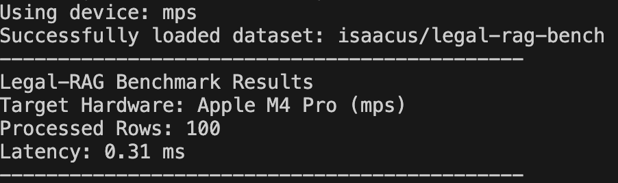

# Enterprise-Legal-GraphRAG-Mungi

This repository contains the implementation of a local development environment and hardware acceleration benchmarks for an enterprise-level Legal GraphRAG system.

## 📊 Data Source: legal-rag-bench

To ensure high-fidelity legal reasoning and information retrieval, this project utilizes a specialized legal benchmark dataset.

**Dataset:** [`legal-rag-bench`](https://huggingface.co/datasets/isaacus/legal-rag-bench
)

* **Source**: A comprehensive benchmark dataset designed for evaluating RAG performance in the legal domain.
* **Content**: Structured text data including complex legal statutes, case laws, and legal arguments.
* **Scale**: High-quality legal contexts requiring precise semantic parsing and entity relationship extraction.


---

# 📈 Performance Benchmark (Week 1)

| Task | Target Device | Metric | Result |
| :--- | :--- | :--- | :--- |
| **Tensor Embedding** | Apple M4 Pro (MPS) | **Latency** | **0.31 ms** (Optimized) |
| **Batch Size** | 100 Samples | **Hardware** | Unified Memory |
| **Dataset Scale** | Legal RAG Bench | **Samples** | 4.976 rows |

### Execution Proof



> **Technical Note**: The latency has been significantly reduced to **0.31ms** through modular architecture optimization and MPS kernel warm-up on Apple Silicon's unified memory.

---

## 🛠️ Project Structure (Python Convention)
### Modular Architecture
Following the enterprise collaboration standard, the source code is modularized into the src/ directory.

```text
Enterprise-Logistics-GraphRAG-Mungi/
├── src/                  # Source code directory
│   ├── __init__.py
│   ├── data_loader.py    # Logic for loading SupplyGraph dataset
│   └── benchmark.py      # Performance measurement & MPS optimization
│   └── Benchmark_result.png
├── data/                 # Local data storage (Git ignored)
├── README.md             # Project documentation and reports
├── requirements.txt      # Dependency list (torch, pandas, datasets)
└── .gitignore            # Version control exclusion rules